# Developer Guide

## Acknowledgements

At this stage, no third-party libraries, external code, or documentation have been reused. Any future integrations or adaptations will be properly documented here.

## Table of Contents

- [Introduction](##ntroduction)
- [Getting Started](#getting-started)
- [Design](#design)
- [Usage](#usage)
  - [Architecture](#architecture)
  - [Main](#main)
  - [Storage](#storage)

## Introduction
NoteUrSaving is a lightweight and efficient financial management tool designed to help students track their incomes and expenses through a simple Command Line Interface (CLI).
With an emphasis on speed and ease of use, this product provides an intuitive platform for managing personal finances, making it an ideal choice for students seeking to stay organized. 
This developer guide outlines the architecture, design principles, and implementation details of the application to support developers in contributing to its ongoing development.

## Getting Started

### Prerequisites: 
* JDK 17
* Gradle 7.6.2 or higher

### Setup:
1. **Fork this project to your own GitHub, and clone it to your computer**
2. **Ensure Intellij JDK 17 is defined as an SDK**, as described [here](https://www.jetbrains.com/help/idea/sdk.html#set-up-jdk) -- this step is not needed if you have used JDK 17 in a previous Intellij project.
3. **Import the project _as a Gradle project_**, as described [here](https://se-education.org/guides/tutorials/intellijImportGradleProject.html).
4. **Verify the setup**: After the importing is complete, locate the `src/main/java/seedu/duke/Duke.java` file, right-click it, and choose `Run Duke.main()`. If the setup is correct, you should see something like the below:
   ```
   > Task :compileJava
   > Task :processResources NO-SOURCE
   > Task :classes
   
   > Task :Duke.main()
   ```
<div style="background-color: #FFA500; border-left: 6px solid #FF0000; padding: 10px; color: #000000;">
  <strong> Important: </strong> Please import this project as a Gradle project
</div>
<br/>


## Design

This section outlines the various components of the application and explains
how they interact to execute the program.

### Architecture

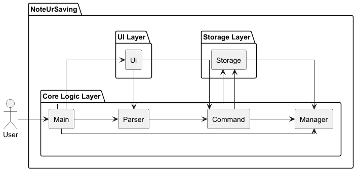

The Architecture Diagram above explains the high-level design of the application

* **Main**: Control the main flow of the application from launch to shut down.
* **Parser**: Parse user input to command that application can execute
* **Ui**: Read user input, display output of user commands, errors and instructions
* **Command**: Executable commands of the application.
* **Storage**: Storing data and settings in hard disk and loading them during the run of application.
* **Manager**: Holds the data while the application is running

### Main
Main will handle the setup and loop to execute the interaction with user

Here are the class diagram shows the important features:


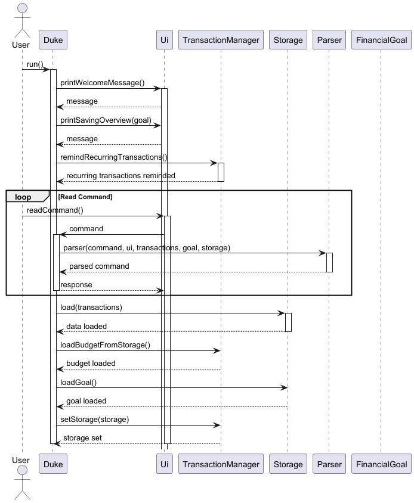

### Storage
Storage will storage all the data in `.txt` and `.csv` file.
Storage will parse the local string data into executable objects.

### UI
The `UI` component contain Ui classes, it will display all message that will be seen by user.
It will also print out errors.

### Parser

### Command

### Manager


## Implementation

### Transaction Basic Data Structure

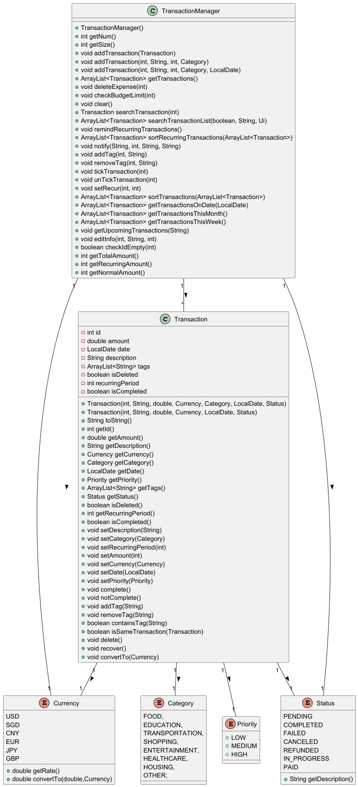

**Feature Description:**
the `Transaction` class as the basic data structure for transactions. It includes the following
fields:

- `id` (Transaction ID)
- `description` (Transaction description)
- `amount` (Transaction amount)
- `currency` (Currency type)
- `category` (Transaction category)
- `date` (Transaction date)
- `status` (Transaction status)

added the ability to set the period at which expenses recur, stored in the `recurringPeriod` field.


**Design Consideration:**  
This data structure provides all the essential information required for a transaction, <br>
and it supports modifying and querying the transaction status (e.g., Pending, Completed).

---

### Transaction Management Features: Tick, Add, Exit, List

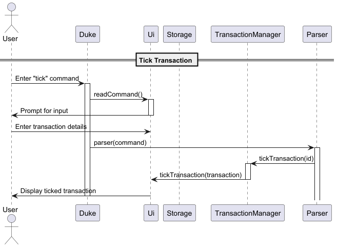
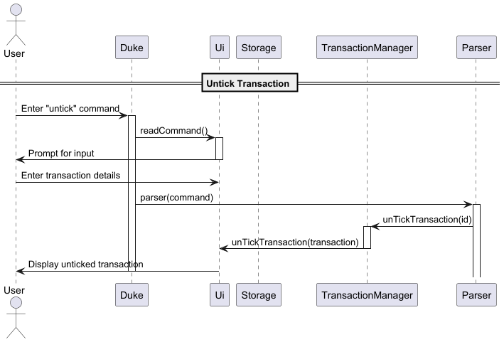
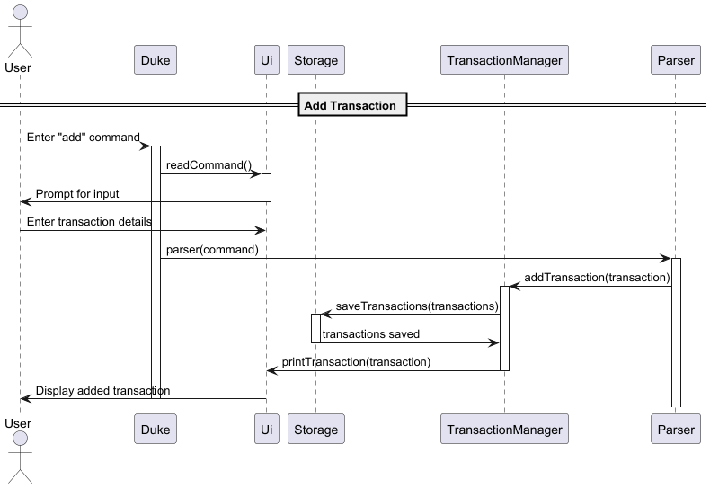
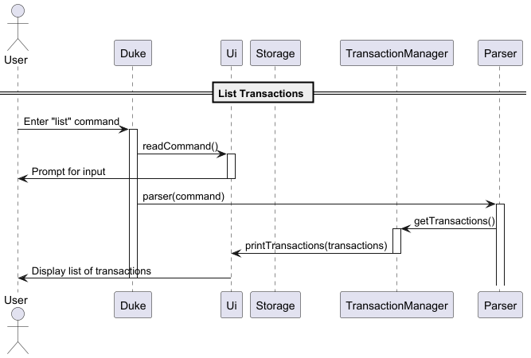

**Feature Description:**  
`Pang Zixi` added several functionalities to manage transactions:
* Mark Transaction: Allows users to mark a transaction with a specific status (Completed or Pending).
* Add Transaction: Users can add a new transaction with description, amount, category, and other attributes.
* List Transaction: User can list all the transactions in the manager.
* Exit Program: Exits the program and ensures any unsaved transactions are stored.


**Design Consideration:**  
These functionalities allow the program to provide basic transaction management capabilities. <br>
Searching and adding transactions is streamlined for ease of use, and the exit process is handled to ensure data
persistence.

---

### Transaction Management Features: Delete, Set Budget Limit and Notifications

##### Deletion
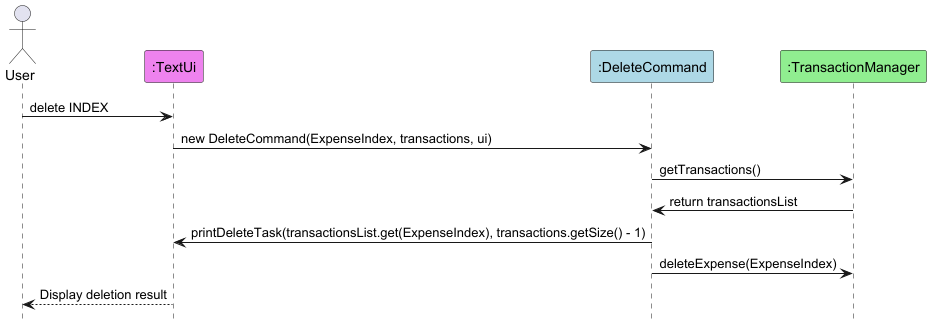

#### Set Budget
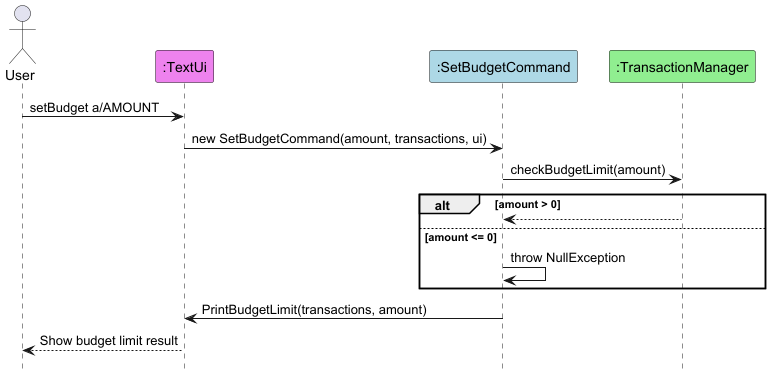

#### Notify 


**Feature Description:**  
`Peng Ziyi` added three main functionalities to delete transaction, set budget limit and notifications for transactions:
* Delete Transaction (delete): Lets users remove unwanted or erroneous transaction entries using their index in the displayed list.
* Set Budget Limit (setBudget): Enables users to define a spending cap to avoid overspending. Once the total recorded expenses exceed this limit, a warning is displayed to alert the user.
* Set Notifications for Upcoming Payments (notify): Allows users to schedule reminders for future expenses based on the transaction's description, amount, category, and due date.

```java
/**
     * Deletes a transaction from the transaction list.
     *
     * @param id the index of the transaction to be removed.
     */
    public void deleteExpense(int id) {
        if (checkIdEmpty(id)) {
            return;
        }
        transactions.remove(id);
    }

/** 
    *function to record and trace the total budget limit
    */
    public void checkBudgetLimit(int budgetLimit) {
        int totalAmount = 0;
        for (Transaction transaction : transactions) {
            if (!transaction.isDeleted()) {
                totalAmount += transaction.getAmount();
            }
        }
        if (totalAmount > budgetLimit) {
            System.out.println("Warning: You have exceeded your budget limit!");
        }
    }
    
/** 
    *Sets a notification for an upcoming transaction
    */
    public void notify(String description, int amount, String categoryString, String date) {
        LocalDate dueDate = LocalDate.parse(date);

        Category category = Category.valueOf(categoryString);

        for (Transaction transaction : transactions) {
            if (transaction.getDescription().equals(description) && transaction.getCategory().equals(category)) {
                transaction.setDate(dueDate);
            }
        }
    }
```

**Design Consideration:**  


The `deletion`, `budget limit` and `notification` features are designed to improve financial awareness and discipline.
Users can monitor their spending relative to a predefined threshold and receive timely reminders for future payments.

These capabilities integrate seamlessly with the transaction management system, enhancing the user experience through automation
and clear visual cues for overspending or pending transactions.

---

### Transaction Management Features: Alert and Set Priority

##### Alert Operation  
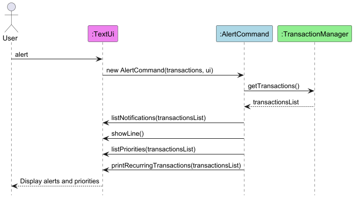

##### Set Priority  
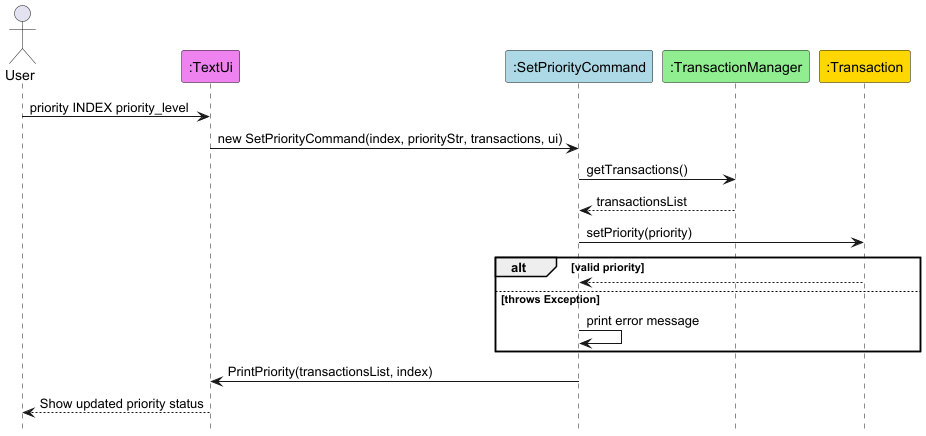

**Feature Description:**  
`Peng Ziyi` added two main functionalities to view spending alerts, set different priorities for transactions:
* Set Priority (priority): Allows users to assign a priority level (low, medium, or high) to a transaction. By default, all expenses are low priority. This helps users focus on the most urgent or important expenses.

* View Spending Alerts (alert): Displays an overview of upcoming expenses, recurring payments, current remaining budget, and whether the spending has exceeded the set budget limit. This command combines notification, priority, and budget insights in a single view.

```java
public AlertCommand(TransactionManager transactions, Ui ui) throws NullException {

    try {
        ui.listNotifications(transactions.getTransactions());
        ConsoleFormatter.printLine();
        ui.listPriorities(transactions.getTransactions());
        Ui.printRecurringTransactions(transactions.getTransactions());
    } catch (Exception e) {
        System.out.println(e.getMessage());
    }
}

/**
 * @param index       The index for the corresponding transaction.
 * @param priorityStr The string representing the priority level want to set.
 */
public SetPriorityCommand(int index, String priorityStr, TransactionManager transactions, Ui ui) throws NullException {
    Priority priority = Priority.valueOf(priorityStr.toUpperCase());

    try {
        transactions.getTransactions().get(index).setPriority(priority);
    } catch (Exception e) {
        System.out.println(e.getMessage());
    }
    ui.PrintPriority(transactions.getTransactions(), index);
}
```

**Design Consideration:**

Priority levels help users organize and focus on transactions based on importance or urgency.

Spending alerts consolidate relevant financial insights—notifications, recurring transactions, and budget status—into 
one unified interface for quick decision-making.

---

### Transaction Management Features: Set Recurring Period, Search, and Edit

`Zhu Yangyi` added the following functionalities to manage transactions:

* Set Recurring Period: Allows users to set transactions to recur every `recurringPeriod` days. <br>
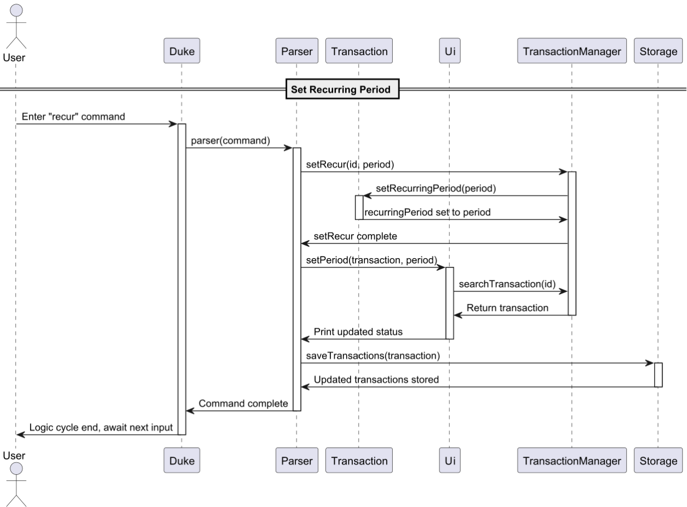
* Search Transaction: Allows users to search through list of transactions by either description (default) or id.
* Edit Transaction: Allows users to edit the description, category, amount, or currency of a transaction.

```java
public void setRecurringPeriod(int recurringPeriod) {
    this.recurringPeriod = recurringPeriod;
}

public ArrayList<Transaction> searchTransactionList(boolean isIndex, String searchTerm, Ui ui) {
    try {
        ArrayList<Transaction> printTransactions = new ArrayList<>();
        if (isIndex) {
            // Searches for transaction with given index and adds to printTransactions
        } else {
            // Searches for all transactions whose description contain the search term and adds to printTransactions
        }
        return printTransactions;
    } catch (Exception e) {
        // Error handling
    }
}

public void editInfo(int id, String info, int type) {
    if (checkIdEmpty(id)) {
    }
    
    // switch-case to update transaction
}
```

**Design Consideration:**  
The ability to set recurring period allows users to manage subscriptions or bills without having to add them
repeatedly. <br>
`searchTransactionList(boolean, String, Ui)` and `editInfo(int, T)` enable users to browse and make changes to their log
with ease.

---

### Transaction Management Features: Filter by date, Currency Conversion, Sort by date

`Faheem Akram` added the following functionalities to manage transactions:

* Upcoming Transactions (`getUpcomingTransactions`): Allows users to get transactions for an upcoming date
* Convert Currency (`convertTo`): Allows users to change from one currency to another

```Java
public ArrayList<Transaction> sortTransactions(ArrayList<Transaction> transactions) {

        transactions.sort((t1, t2) -> {
            if (t1.getDate() == null && t2.getDate() == null) {
                return 0;
            }
            if (t1.getDate() == null) {
                return -1;
            }
            if (t2.getDate() == null) {
                return 1;
            }
            return t1.getDate().compareTo(t2.getDate());
        });

        return transactions;
    }

public void getUpcomingTransactions(String period) {

    period = period.toLowerCase();
    switch (period) {
        case "today":
            System.out.println(getTransactionsOnDate(LocalDate.now()));
        case "week":
            System.out.println(getTransactionsThisWeek());
        case "month":
            System.out.println(getTransactionsThisMonth());
        default:
            try {
                LocalDate date = LocalDate.parse(period);
                System.out.println(getTransactionsOnDate(date));
            } catch (Exception e) {
                System.out.println("Invalid period. Use 'today', 'week', 'month', or a date (yyyy-mm-dd)");
            }
    }
}
```

**Design Consideration:**
The ability to sort by and filter by date allows for the user to quickly find what the soonest transactions will be
so that they can plan accordingly.

---


### Transaction Management Features: Currency Conversion

`Faheem Akram` added the following feature:

* Sort by date (`sortTransactions`): Sorts transactions by date

```Java
public void convertTo(Currency currency) {
double toSGD = 1/this.currency.getRate();
this.amount = currency.getRate() * toSGD;
this.currency = currency;
}
```

**Design Consideration:**

This allows for users to effectively convert between different common currencies.

---

### Goal:

### Financial Goal Basic Data Structure

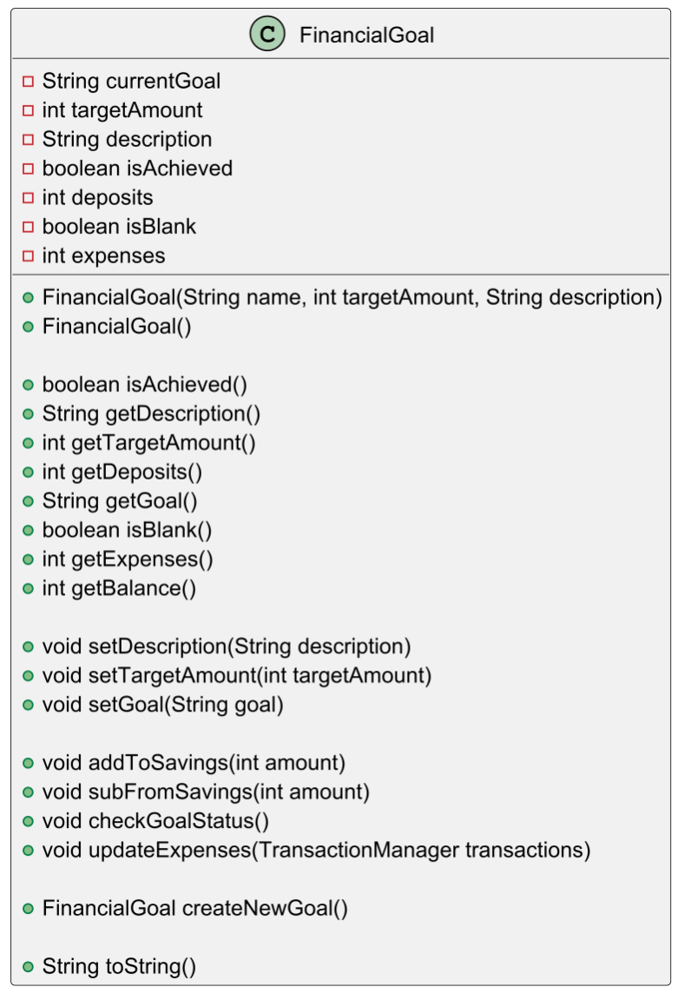

`Faheem Akram` implemented the `FinancialGoal` class with data structure and methods for financial goals. It includes the following fields:

- `currentGoal` (Goal name)
- `targetAmount` (Goal target)
- `description` (Goal description)
- `isAchieved` (Goal achieved status)
- `currency` (Goal currency type)
- `currentAmount` (Transaction date)
- `status` (Transaction status) <br>

`Zhu Yangyi` added the `expenses` field which stores the total amount paid, in order to synchronize expenditure with savings.
  
```Java
  public class FinancialGoal {

  private String currentGoal;
  private double targetAmount;
  private String description;
  private Currency currency;

  // Changeable fields

  private boolean isAchieved;
  private double currentAmount;
  private boolean isBlank;
  private int expenses;
  }
```

`Zhu Yangyi` integrated the `Goal` class into the program through the `Parser` class.

```java
public static void parseGoalCommands(String command, Ui ui, FinancialGoal goal) throws Exception {
    switch (command) {
    case GOAL_TARGET:
        // Command to update target
    case GOAL_DESC:
        // Command to update description
    case GOAL_TITLE:
        // Command to update title
    case GOAL_STATUS:
        // Command to view status
    case GOAL_NEW:
        // Command to create a new goal
    default:
        // View goal (default) / create new goal (if empty)
    }
}
```

**Design Consideration:**  
This implementation allows users to update individual parts of the goal, allowing for a more modular approach when only minor modifications are required to having to set a new goal each time.

---

### Goal Management Features: Create and Check

Feature Description:  
`Faheem Akram` added 2 main functions to Create goals and check them
* Create goal (`createNewGoal`): Lets users create a new goal by prompting them for each field required.
* Check Goal (`checkGoalStatus`):

```Java
public FinancialGoal createNewGoal() {
Scanner sc = new Scanner(System.in);
int amount;
Ui.createGoalConfirm();

    if (!sc.nextLine().equals("Y")) {
        Ui.createGoalAborted();
        return this;
    }
    Ui.createGoalName();
    setGoal(sc.nextLine());
    Ui.createGoalTarget();
    amount = Integer.parseInt(sc.nextLine());
    setTargetAmount(amount);
    Ui.createGoalDescription();
    setDescription(sc.nextLine());
    Ui.createGoalSuccess();
    return this;
}
```

---

### Goal Status Check: Integration with Transactions to Reflect Balance

`Zhu Yangyi` integrated expenses with deposits made to calculate balance to better reflect progress made towards the set goal. `goal.updateExpenses(transactions);` is run each time a goal command is sent to ensure that the progress shown is accurate.
<br> <br>
The total expenditure is calculated through adding `getRecurringAmount()` and `getNormalAmount`.

```java
public int getRecurringAmount() {
    int sum = 0;
    for (Transaction transaction : transactions) {
        if (transaction.getRecurringPeriod() > 0 && !transaction.isDeleted()) {
            long daysBetween = ChronoUnit.DAYS.between(transaction.getDate(), LocalDate.now());
            sum += transaction.getAmount() * (int)((double) daysBetween / transaction.getRecurringPeriod() + 1);
        }
    }
    return sum;
}

public int getNormalAmount() {
    int sum = 0;
    for (Transaction transaction : transactions) {
        if (transaction.getRecurringPeriod() <= 0 && !transaction.isDeleted() && transaction.isCompleted()) {
            sum += transaction.getAmount();
        }
    }
    return sum;
}
```

**Design Consideration:**  
`getRecurringAmount` returns the sum of all past cycles of the transaction up until the current date. <br>
`getNormalAmount` returns all completed one-time transactions. <br>
Both ignore deleted records. 
<br> <br>
The total expenditure is calculated before `goal` commands are executed instead of every time `transactions` is updated. This saves both time in processing and lines of code as this implementation only requires a singular instance of this command being called each time the user wishes to check their progress.

---

## Product scope

### Target user profile

**User Type: University Students**

Demographics:

* Age: 18-25
* Education Level: Undergraduate or Graduate Students
* Financial Situation: Limited budget, dependent on allowances, scholarships, or part-time income

Pain Points:

* Struggles with tracking daily expenses
* Finds it difficult to stay within a budget
* Lacks awareness of spending habits and financial discipline
* Needs reminders to avoid overspending

Needs & Expectations:

* A simple and intuitive way to record transactions
* A budget-setting feature to manage monthly or weekly expenses
* Notifications or alerts when spending exceeds set limits
* A lightweight, user-friendly interface without complex financial jargon

Behavior & Technology Use:

* Prefers mobile apps or web-based solutions for quick access
* Uses digital payment methods (credit/debit cards, mobile wallets)
* May not have prior experience with financial management tools

Ideal Solution:  
A straightforward financial management tool that helps students easily track expenses
, set spending limits, and receive reminders to avoid exceeding their budget.

### Value proposition

This financial management tool helps university students take control of their spending by providing a simple way to record transactions
, set budget limits, and receive spending alerts. It solves the problem of poor financial tracking and overspending by offering a user-friendly 
platform that promotes better money management without overwhelming users with complex financial features.

## User Stories

| Version | As a ... | I want to ...                                         | So that I can ...                                                                |
|---------|----------|-------------------------------------------------------|----------------------------------------------------------------------------------|
| v1.0    | user     | delete financial information                          | correct any upcoming changes in regards to my finances.                          |
| v1.0    | user     | add financial information                             | keep track of my financial goals.                                                |
| v1.0    | user     | set a financial goal                                  | track the financial goal                                                         |
| v1.0    | user     | search through my expenses                            | keep better track of expenses I have to pay for                                  |
| v1.0    | user     | label my expenditures                                 | remember why I want to spend that money                                          |
| v1.0    | user     | tick off my expenditures                              | remember what I have bought and what I haven’t                                   |
| v1.0    | user     | set budget limits                                     | limit the amount of purchases I add.                                             |
| v1.0    | user     | create recurring transactions                         | keep track of regular payments such as subscriptions easily.                     |
| v1.0    | user     | correct financial information                         | mistaken by incorrect financial goals.                                           |
| v2.0    | user     | receive alerts                                        | control it when my spending is higher than usual and have upcoming payments.     |
| v2.0    | user     | prioritise specific expenses                          | see what sort of expenses I should focus on first place.                         |
| v2.0    | user     | receive the reminders for upcoming recurring payments | don’t miss a payment deadline.                                                   |
| v2.0    | user     | view a summary of my expenses for a given time frame  | can get quick information about my finances when I need it.                      |
| v2.0    | student  | document project expenses                             | control the budget granted and to request reimbursements.                        |
| v2.0    | student  | synchronize the expenditures with balances            | can manage the savings better and see any differences.                           | 
| v2.0    | student  | see 5-10 different types of currencies                | can convert back to my home currency when I need to, like USD, SGD, EUR and CNY. |


## Non-Functional Requirements

1. Usability: The interface should be intuitive and easy to navigate, ensuring a smooth user experience for students with minimal financial management knowledge.

2. Performance: The application should be lightweight and responsive, allowing users to quickly log transactions and check their budget without delays.

3. Scalability: The system should be able to handle an increasing number of transactions and users as adoption grows.

4. Security: Users’ financial data should be securely stored and encrypted to protect sensitive information.

5. Availability: The system should maintain high availability, ensuring users can access their financial records at any time.

6. Compatibility: The tool should be accessible across different devices (e.g., smartphones, tablets, and desktops) with a responsive design.

7. Maintainability: The codebase should be well-documented and modular, allowing for easy updates and improvements in the future.

8. Notifications & Alerts: The system should send timely reminders and alerts without causing excessive interruptions or spam.

## Glossary

* *glossary item* - Definition

## Instructions for manual testing

{Give instructions on how to do a manual product testing e.g., how to load sample data to be used for testing}
